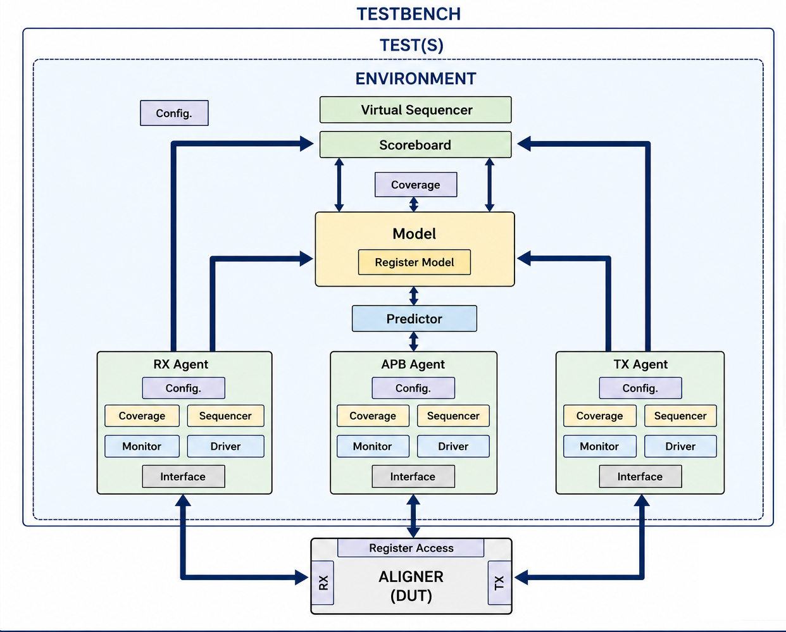
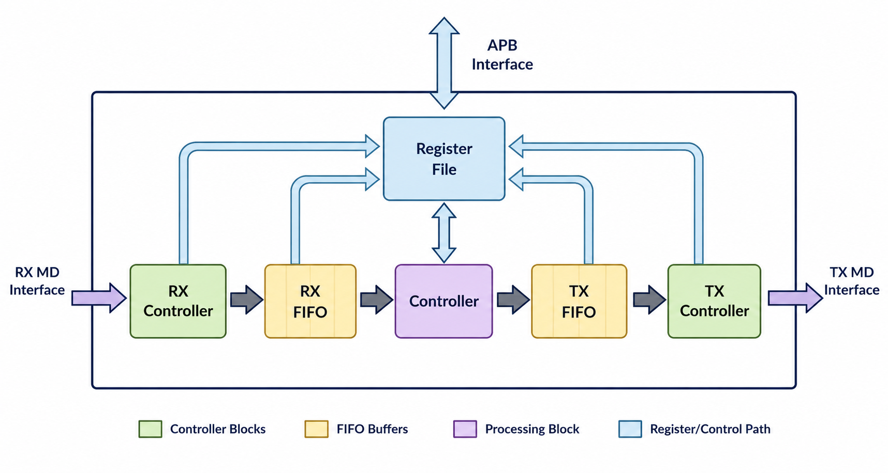
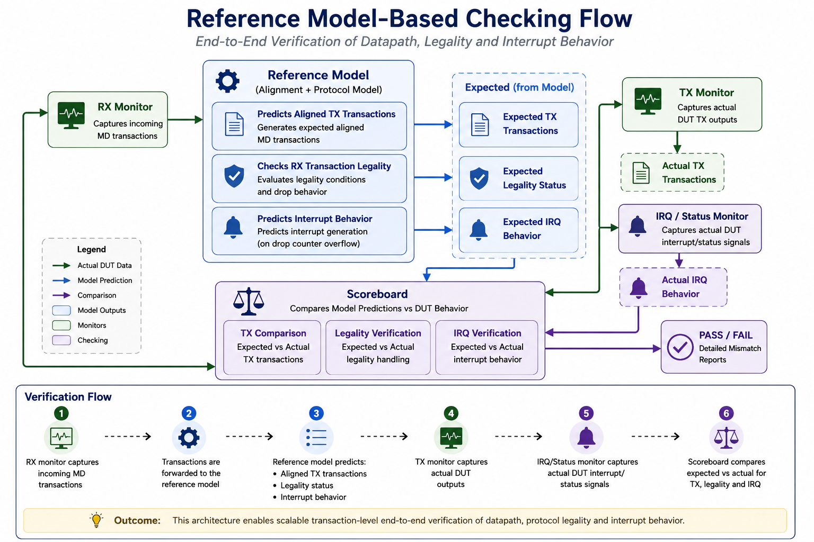

# UVM Verification of Configurable Data Aligner

A scalable SystemVerilog/UVM verification environment for a configurable data aligner IP featuring reusable APB and custom MD protocol VIPs, predictor , scoreboarding, RAL integration, constrained-random verification, functional coverage, and assertion-based protocol checking.
<br>
<br>

 <div align="center">



</div>
<br>


## Project Overview

The Aligner DUT accepts an unaligned stream of memory data transactions and converts them into aligned output transactions based on programmable configuration registers. The design supports configurable alignment size and offset settings through an APB register interface.

The verification environment was developed using **SystemVerilog and UVM** with emphasis on:

- reusable VIP development
- constrained-random verification
- protocol compliance checking
- scalable UVM architecture
- end-to-end functional correctness

The DUT supports:

- APB-based register programming
- Custom MD (Memory Data) streaming protocol
- RX/TX FIFO buffering
- Interrupt generation
- Error detection for illegal transactions
- Flow-control and backpressure handling


## DUT Architecture
<br>

 <div align="center">



</div>
<br>

The DUT consists of:

- RX Controller
- RX FIFO
- Alignment Controller
- TX FIFO
- TX Controller
- APB Register Interface
- Interrupt Logic

The aligner receives unaligned MD transactions from the RX interface, performs alignment based on programmable configuration registers, and transmits aligned data through the TX interface.

### Key DUT Features
- Configurable alignment size and offset
- APB programmable register interface
- Custom MD streaming protocol support
- RX/TX FIFO buffering
- Flow-control support
- Backpressure handling
- Illegal transaction detection
- Sticky interrupt generation
- FIFO status monitoring
- Configurable data width support

## Supported Interfaces
### APB Interface

The DUT exposes a standard AMBA APB interface for:

- register programming
- status monitoring
- interrupt configuration

### MD Streaming Interface

The DUT uses a custom MD (Memory Data) protocol for RX/TX traffic.

Features include:

- valid-ready handshaking
- configurable transaction size
- offset-based alignment
- protocol legality checks
- randomized backpressure support

## MD Protocol Legality Rules

The DUT validates incoming MD transactions using the following legality conditions:

```text
1. ((ALGN_DATA_WIDTH / 8) + offset) % size == 0

2. size + offset <= (ALGN_DATA_WIDTH / 8)
```

Illegal transactions trigger:
- `md_rx_err`
- drop counter increment (`CNT_DROP`)
- interrupt generation upon overflow

## Verification Environment Architecture
### UVM Environment Overview

The verification environment is built using a layered UVM architecture consisting of:

- reusable APB VIP
- reusable MD protocol VIP
- predictor/reference model
- self-checking scoreboard
- UVM RAL model
- protocol assertions
- layered coverage infrastructure

## Verification Components
### APB VIP

Reusable APB verification IP including:

- APB agent
- driver
- monitor
- sequencer
- coverage
- register adapter
- reset handling

### MD Protocol VIP

Reusable UVM VIP for the custom MD streaming protocol supporting:

- active/passive modes
- randomized handshake timing
- randomized delays
- constrained-random traffic
-  legal/illegal transaction generation
- protocol assertions
- configurable agent behavior

The MD VIP uses factory-based instance overrides to derive specialized master/slave implementations from common base classes.

### Reference Model

A transaction-level reference model predicts aligned output transactions based on:

- incoming RX traffic
- CTRL register configuration
- DUT alignment rules

### Scoreboard

The environment uses a Reference Model-Based self-checking scoreboard architecture for end-to-end verification.

# Reference Model-Based Checking Flow
<br>

 <div align="center">



</div>
<br>
The verification environment uses a self-checking reference model-based architecture for end-to-end DUT verification.

The reference model performs:

- transaction alignment prediction
- RX transaction legality checking
- drop counter prediction
- interrupt behavior prediction
## Verification Flow

1. RX monitor captures incoming MD transactions
2. Transactions are forwarded to the reference model
3. The reference model predicts:

     - expected aligned TX transactions
    - legality status
    - expected interrupt behavior
4. DUT interrupt/status behavior is monitored
5. Scoreboard performs expected vs actual comparison
6. Scoreboard compares:

    - expected vs actual TX behavior
    - legality handling
    - interrupt generation behavior

This architecture enables scalable transaction-level end-to-end verification of both DUT datapath and control behavior.

## Register Abstraction Layer (RAL)

The environment includes a complete UVM RAL implementation for:

- CTRL register
- STATUS register
- IRQEN register
- IRQ register

RAL infrastructure includes:

- APB register adapter
- custom register predictor
- mirrored register tracking
- frontdoor register accesses

Register sequences access DUT registers through the RAL model instead of direct APB transactions, improving abstraction and reuse.

Mirror and update operations are used to synchronize predicted register state with monitored DUT behavior.

## Reset Handling Methodology

The verification environment implements hierarchical reset-aware behavior across all major components.

Each agent monitors reset activity and propagates reset events to child components. All child components implement local reset handling to clear:

- internal queues
- pending transactions
- predictor state
- scoreboard state
- protocol tracking information

This prevents stale transaction propagation after reset scenarios.

## Assertion-Based Verification

SystemVerilog Assertions (SVA) are integrated for protocol compliance and temporal property checking.

Assertions verify:

- valid-ready handshake stability
- protocol timing behavior
- signal persistence during backpressure
- APB protocol compliance
- transaction stability until handshake completion

## Functional Coverage Strategy

Coverage collection is partitioned into multiple layers.

### APB Coverage

Protocol-level coverage for:

- read/write accesses
- legal/illegal accesses
- APB transaction behavior

### MD Protocol Coverage

Coverage for:

- RX/TX protocol activity
- transaction sizes
- offsets
- legal/illegal transfers
- randomized handshake scenarios
- backpressure conditions

### DUT Functional Coverage

DUT-specific coverage for:

- transaction splitting behavior
- alignment transformation behavior
- aligned output generation

This layered coverage architecture improves modularity and VIP reuse.

## Test Architecture
### Base Test

`sv_algn_test_base`

- Builds the complete verification environment
- Configures VIPs, model, scoreboard, and RAL infrastructure
- Provides common environment setup

### Register Access Test

`sv_algn_test_reg_access`

- Verifies register functionality
- Exercises RAL frontdoor accesses
- Validates register synchronization using mirror/update operations

### Random Traffic Test

`sv_algn_test_random`

- Randomizes CTRL register configuration
- Generates constrained-random RX traffic
- Applies randomized TX responses
- Verifies end-to-end alignment functionality
- Illegal Access Test

### sv_algn_test_illegal_access

- Extends the random traffic test
- Generates illegal MD transactions
- Verifies illegal transfer handling
- Validates CNT_DROP functionality

## Repository Structure

```text
Aligner_Verification/
│
├── sv_apb_pkg/         # Reusable APB UVM VIP
├── sv_md_pkg/          # Custom MD Protocol VIP
├── sv_algn_pkg/        # DUT-specific verification environment
├── sv_algn_reg_pkg/    # UVM RAL model
├── sv_algn_test_pkg/   # UVM test library
└── testbench.sv        # Top-level testbench
```

## Author

**Sarthak Varshney**

Verification Engineer | SystemVerilog | UVM | VLSI Verification